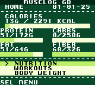
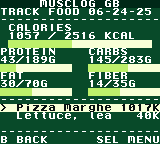
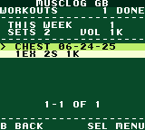
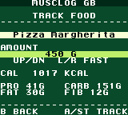
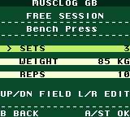
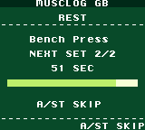
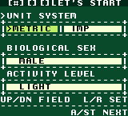
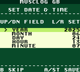
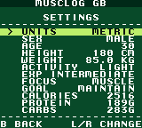

# Musclog GB

Musclog GB is a small, playable Game Boy Color edition of Musclog. It brings the
core loop of the main app to a 160x144 cartridge UI: first-run onboarding,
macro tracking, custom foods, body-weight logging, free workouts, rest timers,
and battery-backed history.

The ROM is built with [GBDK-2020](https://github.com/gbdk-2020/gbdk-2020) and
targets Game Boy Color only. It uses an MBC3 cartridge layout with RTC, RAM, and
battery so dates and logs can survive emulator or flash-cart restarts.

## Screenshots

| Home                                                   | Nutrition                                           | Workout                                      |
| ------------------------------------------------------ | --------------------------------------------------- | -------------------------------------------- |
|  |  |  |

| Track food                                        | Free session                                             | Rest timer                                        |
| ------------------------------------------------- | -------------------------------------------------------- | ------------------------------------------------- |
|  |  |  |

| Onboarding                                      | Date setup                                       | Settings                                   |
| ----------------------------------------------- | ------------------------------------------------ | ------------------------------------------ |
|  |  |  |

## Player Features

- First-run onboarding for unit system, biological sex, activity level, age,
  height, weight, lifting experience, fitness focus, and weight goal.
- Macro goals are generated from the profile, then can be reviewed and edited
  before saving.
- Home dashboard shows today's calories, protein, digestible carbs, fat, and
  fiber against the saved goals.
- Food logging supports date selection, prefix search, serving amounts in grams
  or ounces, food detail screens, and deleting logged entries.
- 517 bundled foods are compiled into ROM banks: 215 USDA foundation foods plus
  302 common foods.
- Up to 100 custom foods can be created on-cart with name, calories, carbs,
  fiber, fat, and protein per 100 g. Custom foods appear first in search and are
  marked with `*`.
- Body-weight tracking stores dated weigh-ins and renders a compact trend chart.
- A Progress dashboard pages through charts over a rolling 7-day or 30-day window
  (toggled with up/down): a summary (distinct muscle groups hit, workout count,
  days logged, average daily calories/protein/carbs/fat) and per-day bar charts
  for calories, protein, digestible carbs, fat, and the body-weight trend.
  Left/right cycle pages.
- Free workout sessions support muscle-group exercise filtering, suggested
  starting weights, editable sets/weight/reps, set editing, a 60-second rest
  timer, and saved workout history.
- 198 bundled exercises are compiled into ROM, grouped by 9 muscle groups.
- Settings let players update profile fields, macro goals, units, and reset all
  saved data.
- MBC3 RTC calibration powers calendar dates. If no clock has been set, the ROM
  falls back to `2025-01-01`.

## Controls

| Button       | Common behavior                                                   |
| ------------ | ----------------------------------------------------------------- |
| D-pad        | Move between rows, scroll lists, or change spinner values         |
| Left / Right | Change selected values quickly, cycle filters, or edit row values |
| A            | Confirm, add a typed character, save a set, or select an item     |
| Start        | Alternate confirm; often shown as `ST` in footers                 |
| B            | Back, cancel, or delete one typed character                       |
| Select       | Open the current screen's menu                                    |

The on-screen footers are the best guide for each screen. `A/ST` means either
`A` or `Start`.

## Build And Run

From the repository root:

```sh
npm run gb:build
```

The build script:

1. Downloads GBDK-2020 into `gameboy/.gbdk/` if `lcc` is missing.
2. Converts `gameboy/assets/logo.png` into generated GBDK asset sources.
3. Compiles every `gameboy/src/*.c` file.
4. Writes `gameboy/build/musclog.gbc`.
5. Checks `gameboy/build/musclog.map` for ROM bank overflows.

To open the last built ROM with the repo's mGBA Flatpak shortcut:

```sh
npm run gb
```

You can also open `gameboy/build/musclog.gbc` in any Game Boy Color emulator
that supports MBC3 RTC and battery saves, such as SameBoy, BGB, mGBA, or
Emulicious.

To publish a freshly built ROM into the web app's in-browser emulator asset:

```sh
npm run gb:copy-rom
```

That copies `gameboy/build/musclog.gbc` to `assets/musclog.gbc`, which is served
by the website Game Boy page through WasmBoy.

## Tooling Commands

```sh
npm run gb:setup         # Fetch GBDK-2020 only
npm run gb:prepare-logo  # Regenerate gameboy/assets/logo.png from the app icon
npm run gb:gen-foods     # Regenerate ROM food tables from data/*.json
npm run gb:gen-exercises # Regenerate the ROM exercise table from data/exercisesData.json
npm run gb:build         # Build the .gbc ROM
npm run gb:copy-rom      # Copy the ROM into assets/ for the website emulator
```

The generated food and exercise C files are committed so normal ROM builds do
not depend on the JSON seed data. Regenerate them only when the source datasets
change.

## Source Layout

```text
gameboy/
  assets/       Source bitmap assets used by the ROM build
  screenshots/  160x144 captures used in this README and website material
  src/          GBDK C source code
  tools/        Node scripts for toolchain setup, data generation, and builds
  build/        Generated ROM, map, and capture artifacts (gitignored)
  .gbdk/        Downloaded GBDK-2020 toolchain (gitignored)
```

Important source modules:

- `src/main.c` boots the splash screen, loads or creates save data, initializes
  stores, and runs the home loop.
- `src/ui_text.c` owns the 20x18 text UI renderer, palettes, menus, value
  screens, confirmations, bars, and date/datetime pickers.
- `src/profile.c` stores the packed profile and macro targets in SRAM bank 0.
- `src/rtc.c` reads and writes the MBC3 RTC and provides calendar helpers.
- `src/home_screen.c` renders the macro dashboard and top-level navigation.
- `src/progress.c` aggregates the food log, workout log, and weight metrics over
  a rolling window and renders the paged progress charts.
- `src/onboarding.c` collects profile details and macro-goal review/editing.
- `src/nutrition.c`, `src/nutrition_search.c`, and `src/nutrition_detail.c`
  implement the food diary, search, serving picker, detail, and delete flows.
- `src/food_db.c` reads bundled ROM food tables and custom foods behind one
  global food index space.
- `src/custom_foods.c` persists user-created foods in SRAM bank 3.
- `src/body_weight.c` and `src/metrics.c` implement dated weigh-ins and the
  body-weight trend chart.
- `src/workouts.c`, `src/workout_session.c`, `src/workoutlog.c`, and
  `src/exercise_db.c` implement free sessions, exercise lookup, recommendations,
  rest timers, saved workouts, and workout details.

## Cartridge Layout

The ROM is linked as a 128 KB CGB-only MBC3 cartridge:

- `-Wm-yC`: Game Boy Color only
- `-Wm-yt0x10`: MBC3 + timer + RAM + battery
- `-Wm-ya4`: four 8 KB SRAM banks
- `-Wm-yo8`: eight 16 KB ROM banks
- Header title: `MUSCLOG`
- Header product/manufacturer patch: `MLOG`

ROM banks are used deliberately:

- Bank 0 contains non-banked code and shared helpers.
- Bank 2 contains USDA foundation foods.
- Bank 3 contains common foods.
- Bank 4 contains nutrition and custom-food screens.
- Bank 5 contains onboarding.
- Bank 6 contains the exercise table.
- Bank 7 contains workout UI and session logic.

SRAM stores are separate and checksummed:

- Bank 0 stores the profile at the start of SRAM and body-weight metrics from
  offset `0x40`.
- Bank 1 stores food log records: day number, food index, and grams.
- Bank 2 stores workout records with summary data plus every logged set.
- Bank 3 stores custom foods in fixed tombstoned slots.

Custom food slots are never compacted. Deleting a custom food clears its name but
keeps the slot stable, so old food-log records never point at a different food.

## Data Notes

Food macros are stored per 100 g. Bundled and custom foods keep energy as whole
kilocalories and macros as decigrams, then serving screens scale those values to
the chosen amount.

The Game Boy nutrition UI follows Musclog's food convention: food `carbs` are
stored as total carbohydrates including fiber, while the carbs progress bar shows
digestible carbs (`carbs - fiber`) against the user's carbs goal.

Workout weights are always stored metrically as kg tenths. When the player uses
imperial units, display pounds are converted at the UI boundary.

Calendar values are stored as day numbers from `2000-01-01`. The RTC setup
screen stores a base date and resets the MBC3 day counter; current date is
derived by advancing that base date by elapsed RTC days.

## Development Notes

- Keep generated tables in sync with their source data by using
  `npm run gb:gen-foods` and `npm run gb:gen-exercises`.
- Keep `gameboy/assets/logo.png` committed. The build converts it into generated
  `src/logo.c` and `src/logo.h`, which are gitignored.
- After adding large tables or new screens, run `npm run gb:build` and inspect
  the bank layout output. The build fails if fixed or switchable banks overflow.
- Prefer keeping ROM-bank-sensitive readers non-banked when they call
  `SWITCH_ROM()`. `food_db.c` and `exercise_db.c` show the pattern.
- Use raw `_SRAM[]` access only through the existing store modules and checksum
  helpers. Profile, food log, workout log, metrics, and custom foods each own
  their layout.
